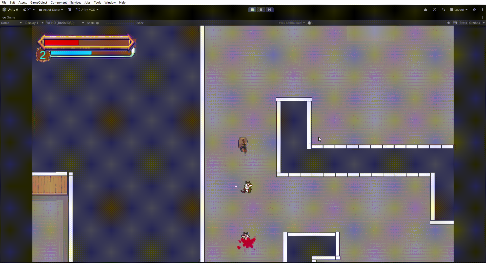
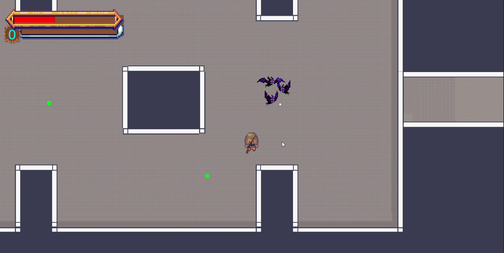
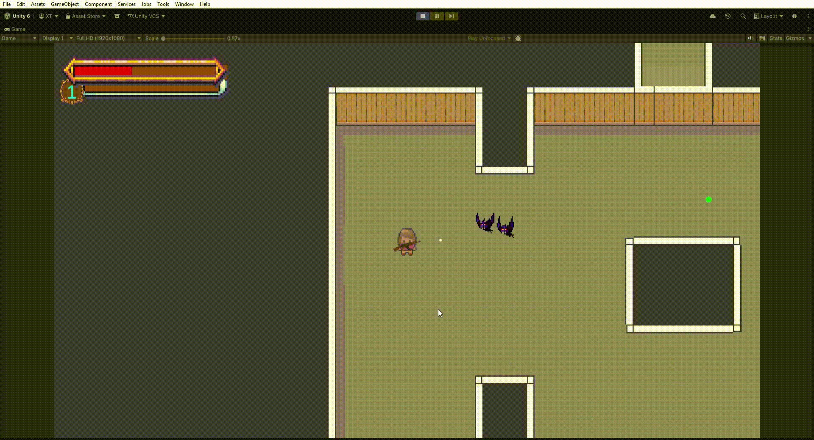
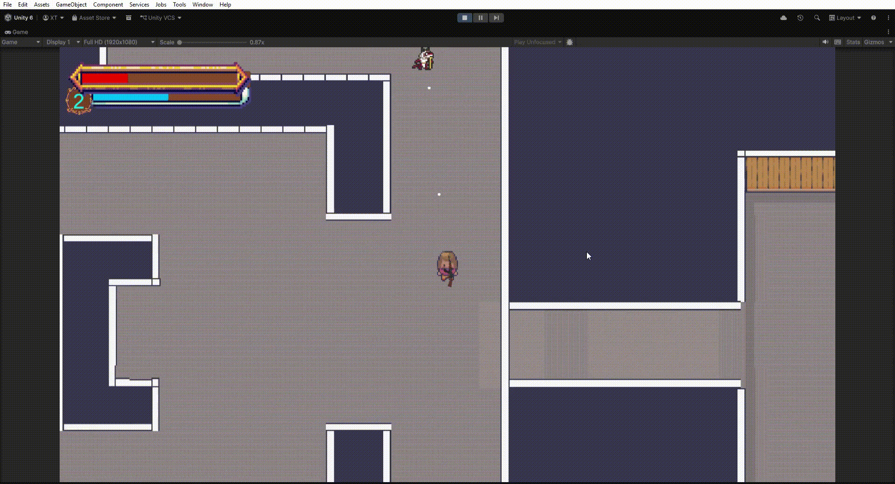
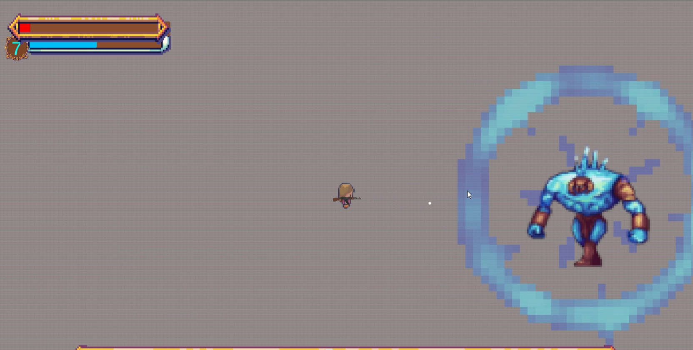
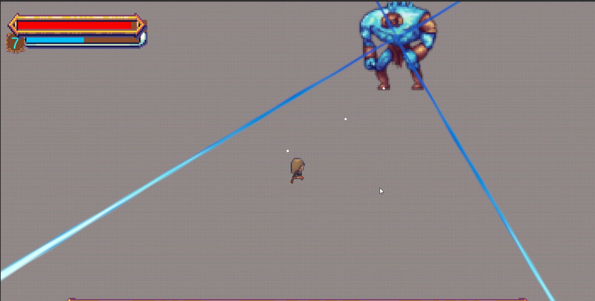
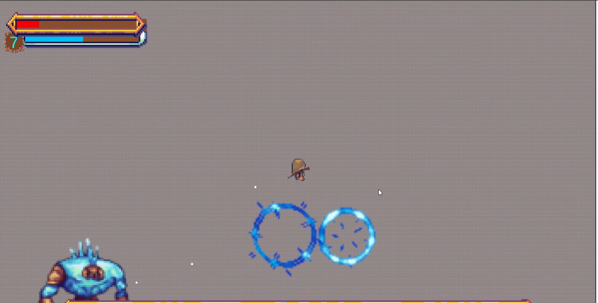

# 🎮 Survivor Dungeon

> A fast-paced survival game inspired by **Survivor.io**

Người chơi phải sống sót trước hàng đàn quái vật trong các hầm ngục nguy hiểm, thu thập EXP, nâng cấp kỹ năng và đánh bại các Boss với nhiều cơ chế chiến đấu khác nhau.

---

# ✨ Features

## ⚔️ Real-time Combat System

* Tấn công tự động
* Né tránh quái và đạn
* Số lượng quái ngẫu nhiên theo từng phòng

<table>

<tr>
<td width="50%">

</td>

<td width="50%">

</td>
</tr>

<td width="50%">

</td>
</tr>

</table>

---

## 📈 Upgrade & Leveling System

Người chơi có thể:

* Thu thập EXP từ quái
* Lên cấp trong trận đấu
* Chọn nâng cấp ngẫu nhiên  
* Tạo build kỹ năng riêng

<table>

<tr>
<td width="50%">

</td>
<td width="50%">

</td>
</tr>

</table>

### 🔹 Example Upgrades

* Increase Damage
* Attack Speed Boost
* Health Regeneration
* Movement Speed
* Weapon Enhancement

---

## 👹 Boss System

Mỗi Boss đều có bộ kỹ năng riêng:

* Dash Attack
* Area Damage (AoE)
* Bullet Patterns
* Summon Minions
* Rage Phase

Boss không chỉ mạnh hơn về chỉ số mà còn có cơ chế chiến đấu khác nhau.

<table>

<tr>
<td width="50%">

</td>
<td width="50%">

</td>
</tr>

<tr>
<td width="50%">

</td>
</tr>

</table>

---

## 🏹 Enemy Types

### 🪓 Melee Enemies

* Áp sát người chơi
* Tấn công cận chiến
* Xuất hiện số lượng lớn

### 🎯 Ranged Enemies

* Tấn công từ xa
* Giữ khoảng cách
* Ép người chơi phải di chuyển liên tục

---

## 🗺️ Dungeon Maps

* Dark dungeon atmosphere
* Increasing difficulty
* Survival-focused gameplay
* Multiple dangerous areas

---

# 🛠️ Technologies

* **Engine:** Unity
* **Language:** C#
* Enemy AI System
* Wave Spawn System
* Upgrade System
* Boss Pattern System

---

# 🚀 Future Plans

* More Characters
* Passive Skill System
* Inventory & Equipment
* Procedural Dungeon
* More Boss Phases
* Item Rarity System

---

# 📸 Gameplay Preview
* Please click for full video 

---

# 🎯 Inspiration

* Survivor.io
* Vampire Survivors
* Hades

---

# 👨‍💻 Author

**Your Name**
Game Developer
